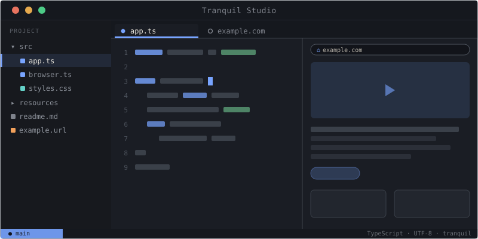

# Tranquil Studio

**A desktop code editor rebuilt around a first-class web browser.**
Web apps open as tabs, links save as files, and pages can be scripted — one workspace for
the web apps and files your work spans.

[Website](https://tranquillabs.dev) · [Docs](https://tranquillabs.dev/docs/v0.1.0/overview/introduction) · [Releases](https://github.com/tranquillabs/tranquil-client/releases) · [Discussions](https://github.com/orgs/tranquillabs/discussions)

---

> **Developer preview — not stable.** Tranquil is in early, active development. APIs, interfaces,
> and behavior are provisional and will change before a stable release. Don't build anything you
> depend on against it yet.

## What is Tranquil?

Tranquil Studio is an Electron desktop editor where a real Chromium browser is a first-class
citizen next to your files: open web apps as editor tabs, save links as `.url` files in your
project, and drive live pages with plain-JavaScript automations.

## Highlights

- **Browser** — real sites as splittable editor tabs with a URL bar, history, zoom, DevTools,
  find-in-page (⌘F), a configurable User-Agent, and a branded start page; snapshot a page to a
  HAR and replay it offline.
- **Local URLs** — drag any tab onto the Project Pane (or press ⌘S) to save it as a `.url` file;
  trash and restore bookmarks; open `.url` files back into the browser.
- **Windows** — per-window browser sessions (the same site logged in under different accounts per
  window) and a per-window accent color to tell windows apart.
- **Project Pane** — semantic file-type icons, folder-count pills, hover rename/delete,
  ⌥/⌘ drag-to-copy, and undoable file operations.
- **Automations** — write plain JavaScript and run it against a live browser tab with ⌘⇧R, or
  register any `.js` file as a named command.
- **Settings & themes** — a first-class settings tab with a live UI-theme picker, plus refreshed
  default light and dark themes.

## Getting started

Download the latest preview from the
[releases page](https://github.com/tranquillabs/tranquil-client/releases), or build from source —
the [Local Dev Setup runbook](https://tranquillabs.dev/docs/v0.1.0/development/local-dev-setup)
clones the sibling packages, wires them together, and launches the app.

## The Tranquil toolkit

Tranquil Studio (this repo) is one of four pieces:

| Piece | What it is |
| --- | --- |
| **Studio** | The desktop editor and automation workspace (this repo). |
| **Browser** | The embedded Chromium browser — your window onto any web app. |
| **Engine** | A runtime to package and run automations headlessly (e.g. in CI/CD). |
| **Automations** | The JavaScript SDK — sequences of steps across your apps, on a schedule or on demand. |

## License

[MIT](LICENSE.md) © Tranquil Labs.

Tranquil is a fork of [Pulsar](https://pulsar-edit.dev), itself a fork of Atom; the original
copyright notices are retained in [LICENSE.md](LICENSE.md).
